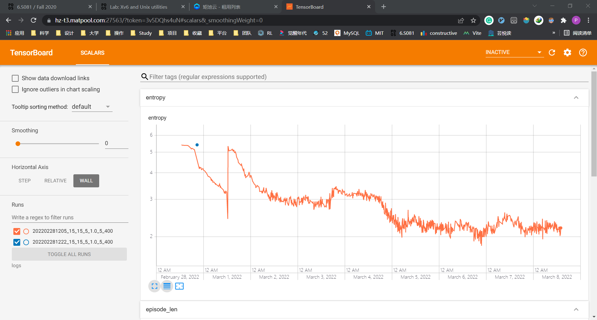

# five-in-a-row-AI
♟️ Deploy a AI five-in-a-row game. Including front-end, back-end &amp; deep RL code.

前端基于 Vue3 构建，后端由 flask 提供简单的 restful 接口，调用 AlphaGo 算法（基于强化学习 + 蒙特卡洛树搜索）。

Python 建议 3.6+ 版本， npm 建议 14.0+ 版本。棋盘大小、AI参数等均可自行配置（注意，更改棋盘大小后，需要重新训练对应棋盘大小的神经网络权重）。

<p style="text-align: center;"><a href="https://piperliu.github.io/five-in-a-row-AI/">✨GitHub Demo Page✨</p>

gif

## ⚙️How to use | 如何一键使用

下载本项目至你的服务器：

```bash
git clone https://github.com/PiperLiu/five-in-a-row-AI.git
```

### 📄生成前端页面

在 [./front-end/aichess/src/hooks/useChessRequestHook](./front-end/aichess/src/hooks/useChessRequestHook) 中更改你的接口。

```typescript
...
      axios.post(url, data, {
        baseURL: 'https://aichess.piperliu.xyz',  // 你的 API
        headers: {
          'Content-Type': 'application/json'
        }
...
```

生成页面需要一点前端基础，具体可见 [./front-end/aichess/README.md](./front-end/aichess/README.md) 。

```bash
cd front-end\aichess
npm install
npm run build
```

### ⚗️部署后端服务

注意，后端项目和 AI 训练使用的 Python 环境相同，具体依赖在 [./requirements.txt](./requirements.txt) 中。可以使用如下 pip 命令安装。

```bash
pip install -r requirements.txt
```

运行 [./back-end/main.py](./back-end/main.py) 。

```bash
cd back-end
python3 main.py
```

### 🤖训练你的 AI

训练 AI 涉及到：你是像继续训练同一个神经网络，还另开一个炉灶。你可以通过命令行来告诉脚本，可以参考 [./ai/main.py](./ai/main.py) 。

```bash
cd ai
python main.py
```

## 🤔思考

前端总体没啥难的。但引入 live2d.js 时发现没有 npm ，只能在 index.html 里通过 script 引入一个 js 文件。于是就在 live2d 对应的 [./front-end/aichess/src/components/LiveGirlComponent.vue](./front-end/aichess/src/components/LiveGirlComponent.vue) 组件内：

```typescript
(window as unknown as Record<'loadlive2d', (arg1: string, arg2: string) => void>)
    .loadlive2d('live2d', 'live2d/model/tia/model.json')
```

后端最为简单，毕竟这里也没有数据库操作、没有并发处理，就是用 flask 暴露了一个 post 接口，你把棋盘的样子传给我，我把下一步下在那里告诉你。

但后端也是最费时的：在浏览器中被要求请求必须是 https 的，于是去给域名申请 ssl 。主要用到了 [acme.sh](https://github.com/acmesh-official/acme.sh) + nginx 。此外，我的后端跑在我的阿里云服务器的 docker 里，在里面再套上 tmux 保证运行的稳定性。 nginx 实现了一个转发：我的 flask 服务是 localhost:5000 ，我将 aichess.piperliu.xyz 转发到了 localhost:5000 。

最后，阿里云对没有备案的域名（我的 piperliu.xyz ）进行了拦截。所以还要老老实实备案。

关于 AI 训练： 8 × 8 的版本早就训练好了，见 [./back-end/models/current_policy_1.model](./back-end/models/current_policy_1.model) ，但是 15 × 15 的十分吃力 ：



如上是熵值（MCTS最优动作与神经网络决策的熵），熵值越低 AI 越强大。训练了大概有 9 天，发现其熵值是突发性地降低的——这说明强化学习的训练很大程度与采样有关，采样平平无奇，则一直没有进步；采用突发奇想，可能会带来巨大的进步。

具体的讨论我放在 [./ai/README.md](./ai/README.md) 中了。
