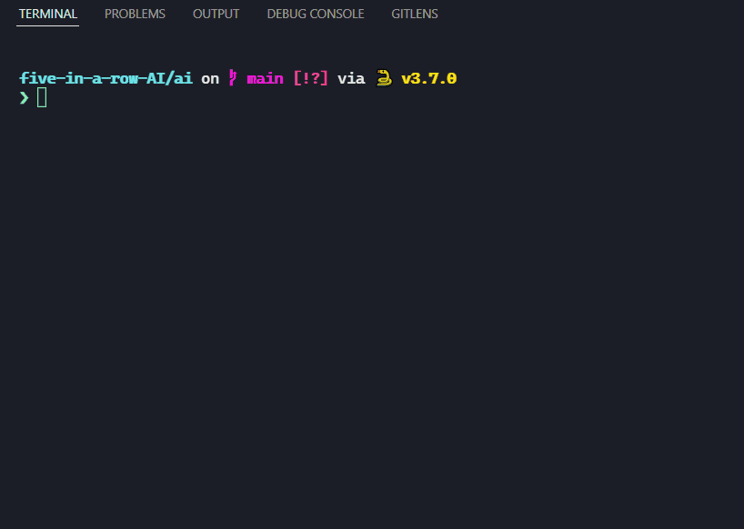
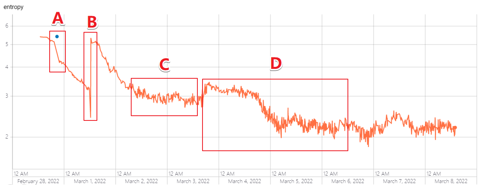
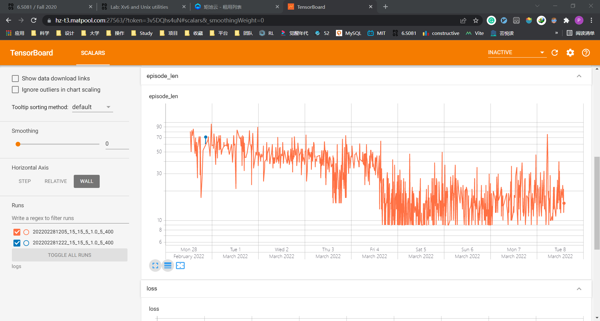
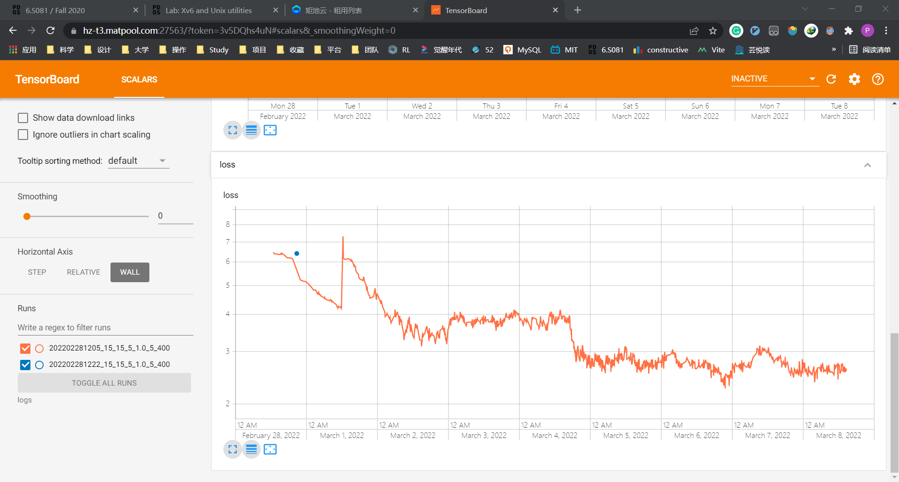
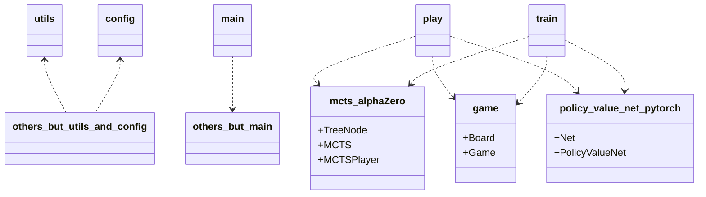

# 单线程 MCTS + RL 五子棋

如上，使用 `python play.py` 可以“感受”当前 AI 的能力。

主要，你选择的网络，应该与 [./config.py](./config.py) 中的棋盘大小相匹配，否则报错。

## 强化学习训练的讨论：最为关键的采样

如上是熵，什么是熵呢？

就是将当前状态 $S$ 分别进行 MCTS 迭代与神经网络迭代，获得两个输出。

将两个输出做 MSE ，如果两个输出趋近于一致（即神经网络可以得到与 MCTS 模拟一致的预判），那么说明神经网络比较牛逼了。这个时候熵就会很低。

这里是我对 [../back-end/models/202202281205_15_15_5_1.0_5_400](../back-end/models/202202281205_15_15_5_1.0_5_400) 进行 9 天训练之后得到的结果。

发现，在 A 阶段，有个数据的陡降，那是因为我把训练停了，重新找了台服务器，调了下学习率，接着训练； B 阶段有个质变般的大回升，那也是因为我又把训练听了，重新找了台服务器，又调了下学习率接着训练。

**为什么停掉训练再接着训练之后，熵就会变化巨大？**

我的推测如下：
- 虽然我改动了学习率，但这不是根本原因，因为我对于学习率的改变非常微小，在深度学习中学习率很重要，但是微小的改变不会导致质变
- **停掉训练，没有保存下来当前 buffer 里的样本。** 我认为这是根本原因。 buffer 里的样本是有连续性的，换句话说，是来自于某一个分布（这个分布由当前环境与策略共同决定）。当我们重新收集 buffer 时，这个连续性就中断了，由此导致神经网络输出乱掉、熵上升。

还注意到， C 阶段很平稳，但是我并没有停掉训练，因为此时神经网络表现还很不好，我对此有两个猜测：
- 神经网络不够大，不足以精炼 15×15 的棋盘信息
- **由于这里的数据是由神经网络自己和自己下棋获得的，因此很容易陷入局部最优解（当你的敌人不够强大时，你也很难变强）**

如 D 阶段，事实证明，是采样不到位。因为一些随机采样策略，神经网络最终找到了更好的策略。

这里，我的采样策略设计的并不零活，因此训练的效率很低。

最后，贴上其他训练指标，如下。

### References

代码参考了 [深入浅出强化学习：编程实战](http://www.broadview.com.cn/book/5562) 。

项目结构：

